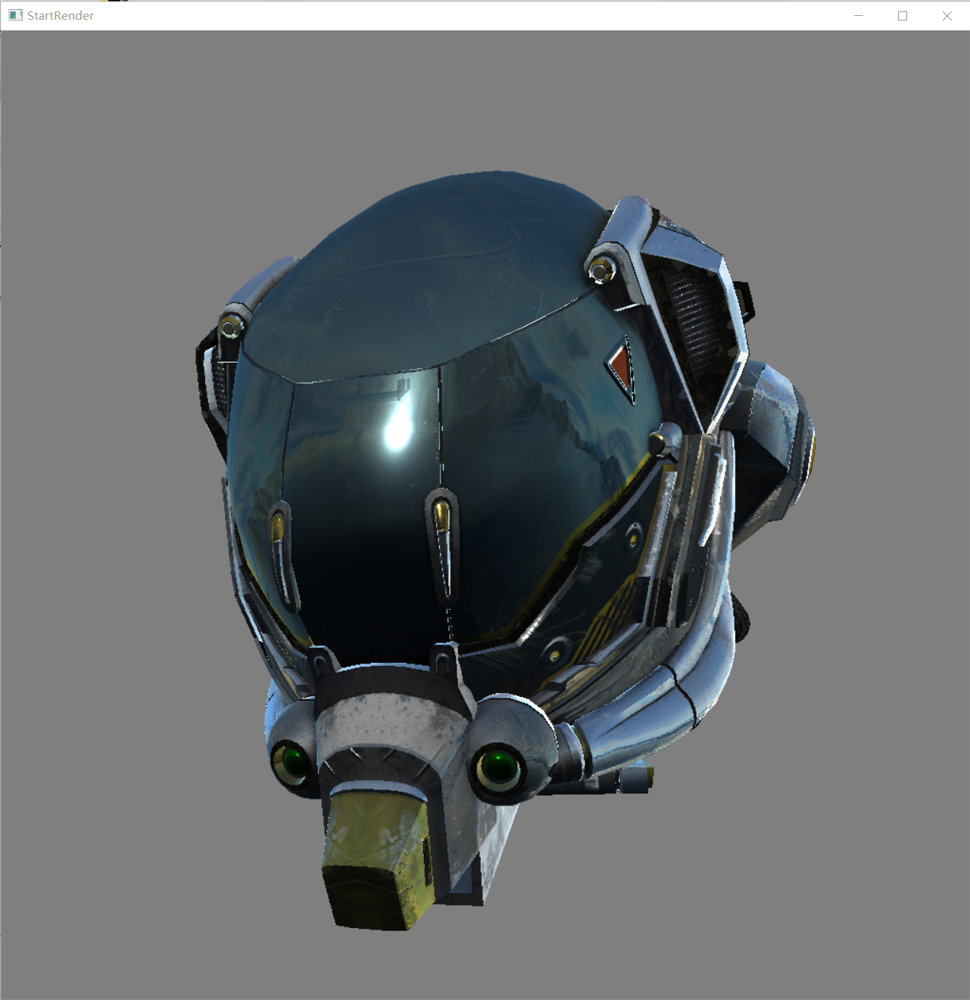

## 简单3D渲染引擎
### 概述
一个C++语言编写的软光栅**实时渲染**引擎,大学毕业设计。  
完全从零开始开发,在渲染部分不依赖任何框架。
  

### 渲染图示例

### 构建环境
CMake+MSVC

#### 第三方库
SDL: 底层图形输出,只作为framebuffer输出与渲染逻辑无关  
Imgui: GUI框架  
ghc::filesystem: 解决不同操作系统path  
lodepng: 解析png图像  
trubo-jpeg:解析jpeg图像  

### 渲染引擎特效
math库  
光栅化优化  
SIMD优化  
视角移动   
PBR渲染,部分代码参考unity shader  
加载gltf格式模型,仅支持部分功能  
支持baseColor,normal,metallic,roughness贴图
支持简单CubeMap天空图

### 待完善
渲染颜色不准,Fresnel待修正  
Mipmap,各项异性过滤  
MSAA抗锯齿  